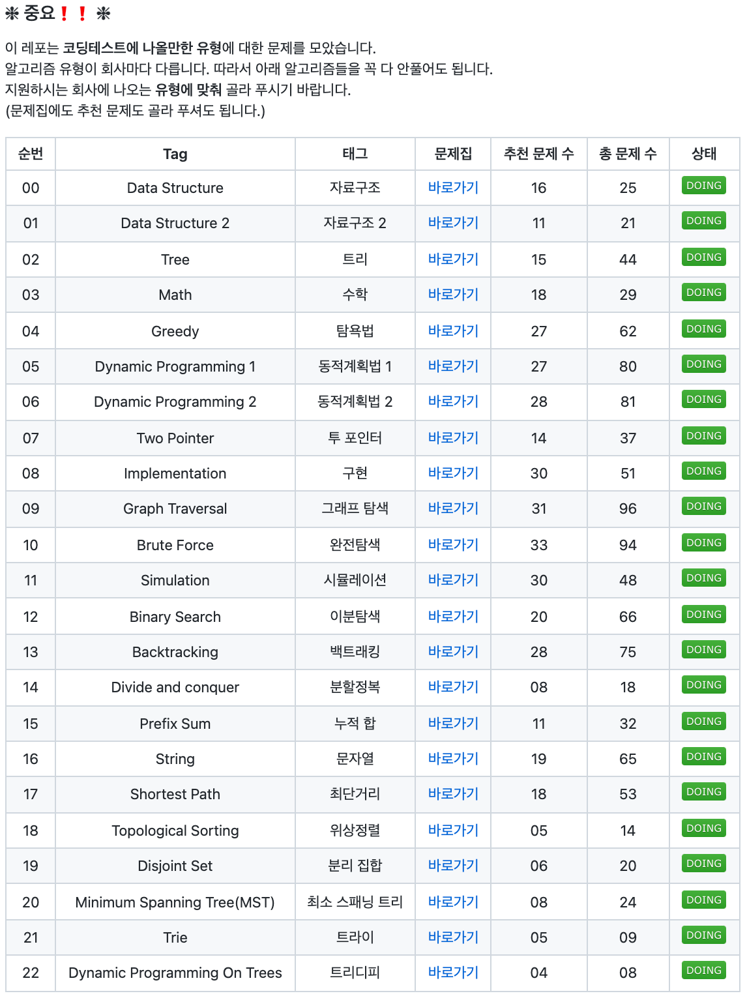

# 스터디 진행 계획 제안 (by 조정제)

## 플랫폼 제안

**플랫폼:** [백준 (BOJ)](http://www.boj.kr) 

 

## 스터디 컨텐츠 제안

### 1. 백준 강의 문제 풀이

백준 사이트 내 [강의 목록](https://www.acmicpc.net/lectures) 에서 알고리즘 기초 강의와 알고리즘 중급(1-2) 강의 문제들을 선별하여 풀이  (강의를 수강을 제안하는 것은 아닙니다.)

아래는 알고리즘 기초 1번 강의에 포함되어 있는 문제 중 일부 입니다.  

<h4>자료구조 1</h4>
<ul>
<li><a href="https://www.acmicpc.net/problem/10828">스택</a></li>
<li><a href="https://www.acmicpc.net/problem/9093">단어 뒤집기</a></li>
<li><a href="https://www.acmicpc.net/problem/9012">괄호</a></li>
<li><a href="https://www.acmicpc.net/problem/1874">스택 수열</a></li>
<li><a href="https://www.acmicpc.net/problem/1406">에디터</a></li>
<li><a href="https://www.acmicpc.net/problem/10845">큐</a></li>
<li><a href="https://www.acmicpc.net/problem/1158">조세퍼스 문제</a></li>
<li><a href="https://www.acmicpc.net/problem/10866">덱</a></li>
</ul>
<h4>자료구조 1 (연습)</h4>
<ul>
<li><a href="https://www.acmicpc.net/problem/17413">단어 뒤집기 2</a></li>
<li><a href="https://www.acmicpc.net/problem/10799">쇠막대기</a></li>
<li><a href="https://www.acmicpc.net/problem/17298">오큰수</a></li>
<li><a href="https://www.acmicpc.net/problem/17299">오등큰수</a></li>
</ul>
<h4>자료구조 1 (참고)</h4>
<ul>
<li><a href="https://www.acmicpc.net/problem/1935">후위 표기식2</a></li>
<li><a href="https://www.acmicpc.net/problem/1918">후위 표기식</a></li>
<li><a href="https://www.acmicpc.net/problem/10808">알파벳 개수</a></li>
<li><a href="https://www.acmicpc.net/problem/10809">알파벳 찾기</a></li>
<li><a href="https://www.acmicpc.net/problem/10820">문자열 분석</a></li>
<li><a href="https://www.acmicpc.net/problem/2743">단어 길이 재기</a></li>
<li><a href="https://www.acmicpc.net/problem/11655">ROT13</a></li>
<li><a href="https://www.acmicpc.net/problem/10824">네 수</a></li>
<li><a href="https://www.acmicpc.net/problem/11656">접미사 배열</a></li>
</ul>

### 2. 코딩 테스트 대비 문제집 with Baekjoon 추천 문제 풀이

코테 대비 추천 문제 관련해서 검색을 하다가 찾은 [문제집 Repo](https://github.com/tony9402/baekjoon) 입니다. 퀄리티가 어떠한지 세심하게 확인해보지는 못했지만, 다수의 컨트리뷰터들이 지속적으로 업데이트 해나간다는 점 + Star 1.4k 를 감안했을 때 나쁘지 않은 선지가 될 것 같아 제안해봅니다. (해당 문제집으로 진행하지 않더라도 레포 들어가셔서 리드미 일독 추천드려요~) 

아래는 README 중 일부를 캡쳐한 것 입니다. 

이외에도 매일 알고리즘 분류와 관련 없이 풀만한 문제를 뽑아주는 문제집도 있습니다. (cf. [오늘의 문제](https://github.com/tony9402/baekjoon/blob/main/picked.md)) 

`오늘의 문제` 는 굵직한 주제들을 어느 정도 훑은 후에 이용하면 좋을 것 같아요 :)

